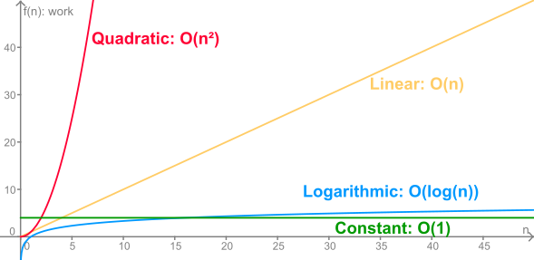

# Big-O

big-o is a way of describing the speed and memory usage of an algorithm
algorithms can run faster or slower given a specific input thus we only use
big-o to describe the worst case

the letter "n" is used to describe the number of items/calculations an algorithm is operating on

if an algorithm only makes single statements in the worst case, it is said that the algorithm runs with an "O(1)" runtime
"O(1)" runtime is also called constant time

if an algorithm recursively cuts its iteration in half from "n" until 1, it is said that the algorithm runs with an "O(log(n))" runtime
"O(log(n))" runtime is also called logarithmic

if an algorithm runs through every item, it is said that the algorithm runs with an "O(n)" runtime
"O(n)" runtime is also called linear time

if an algorithm runs through a list of "n" items "n" times it is said that the algorithm runs with an "O(n^2)" runtime.
"O(n^2)" runtime is also called quadratic time
